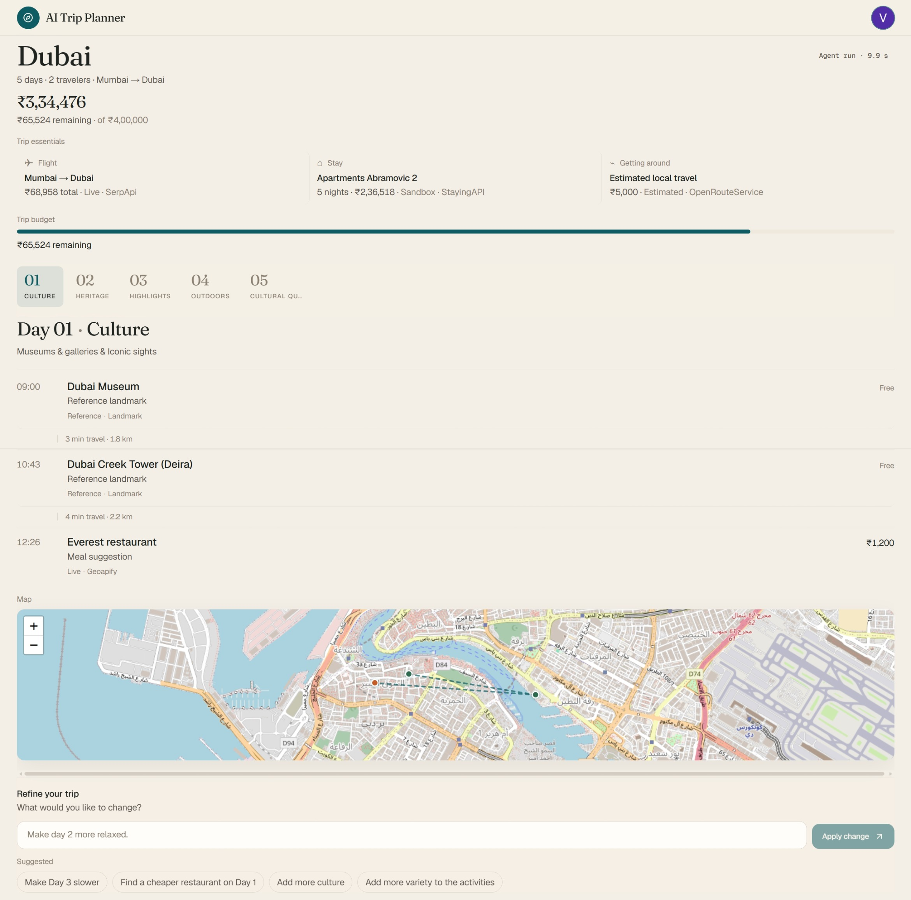
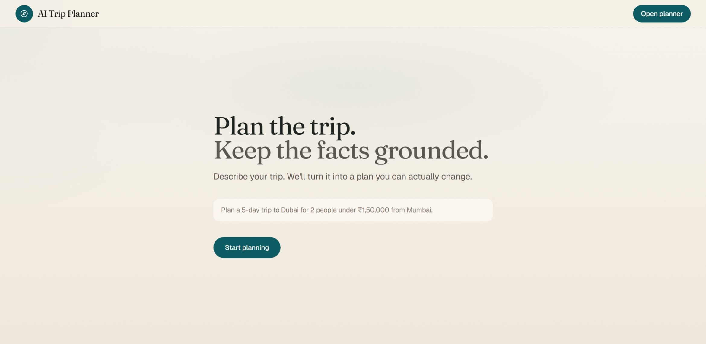
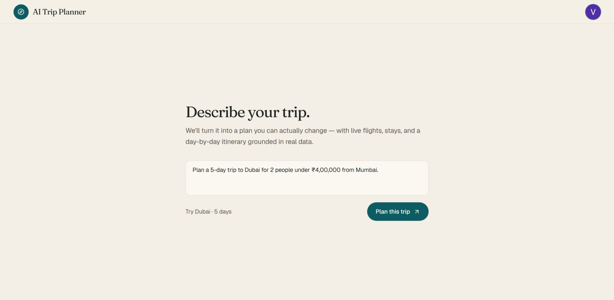
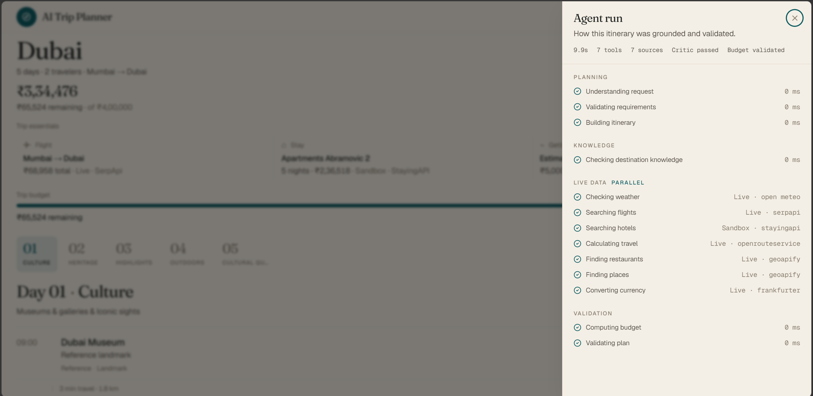
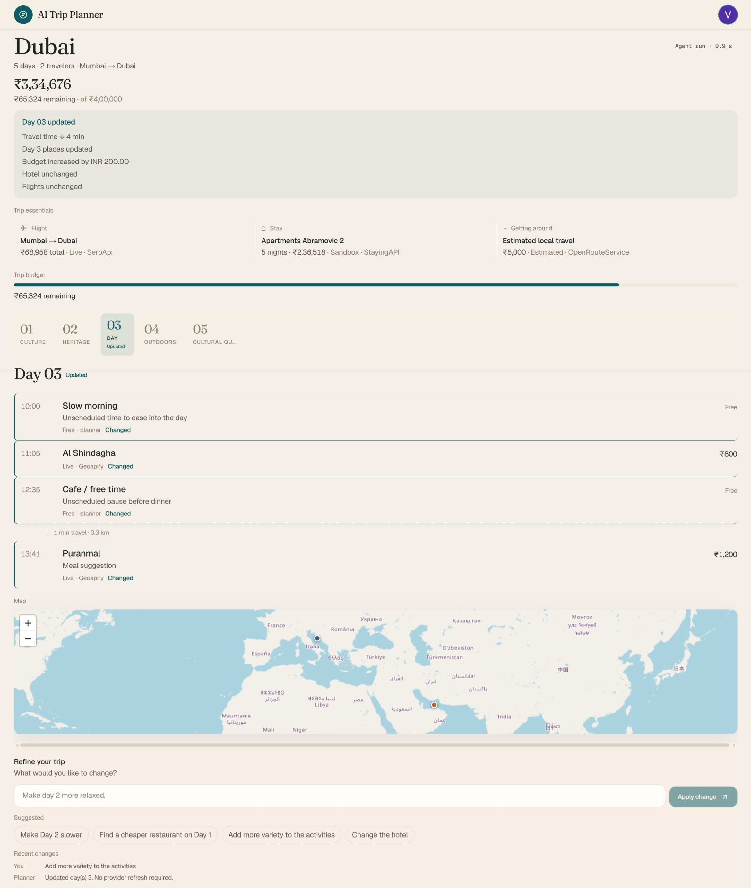
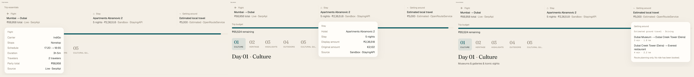
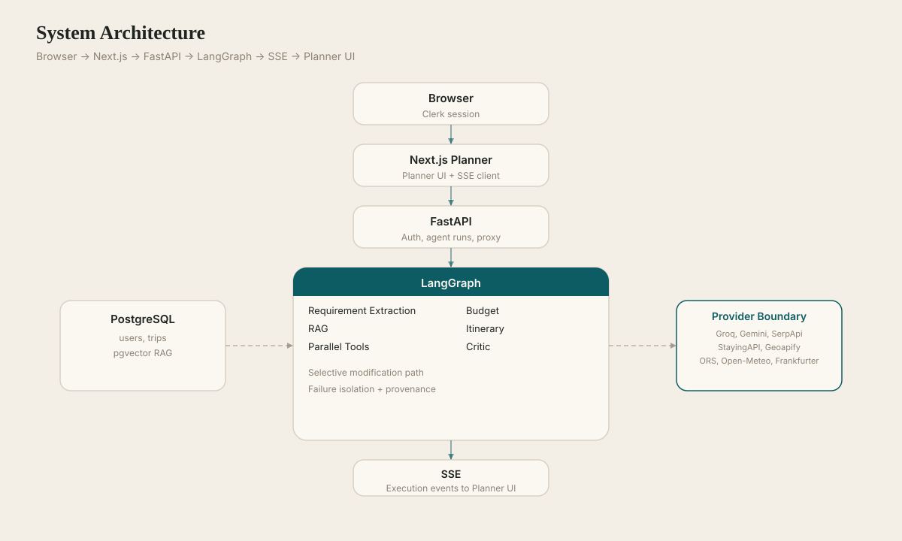
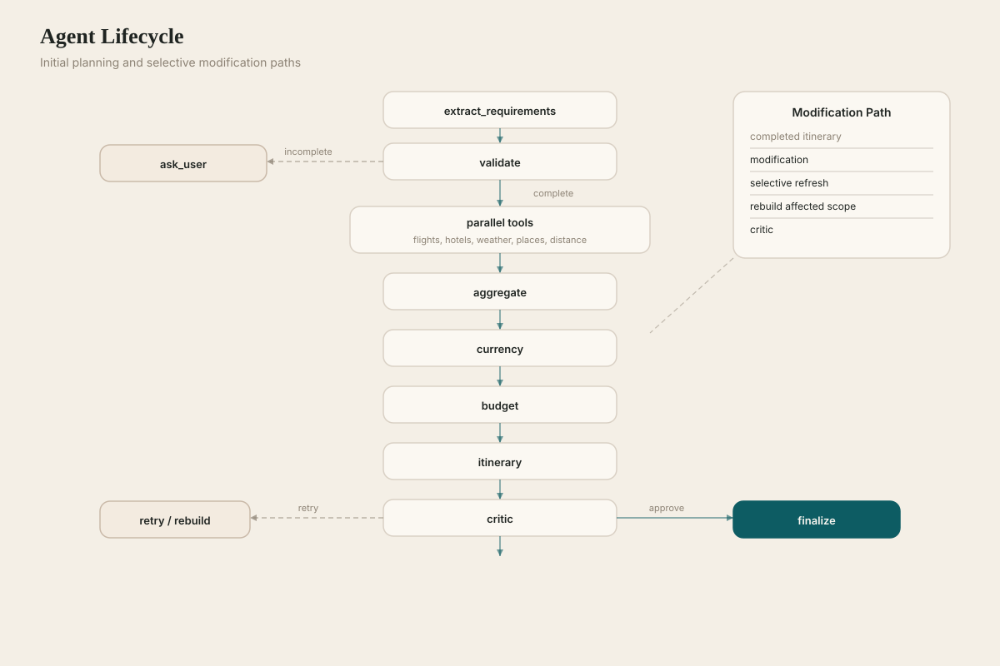
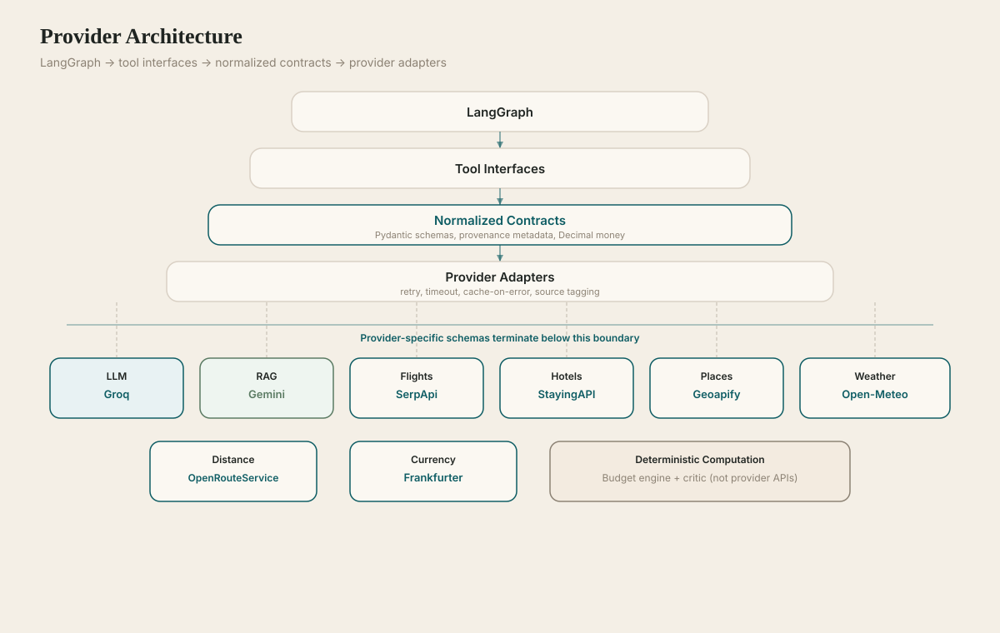
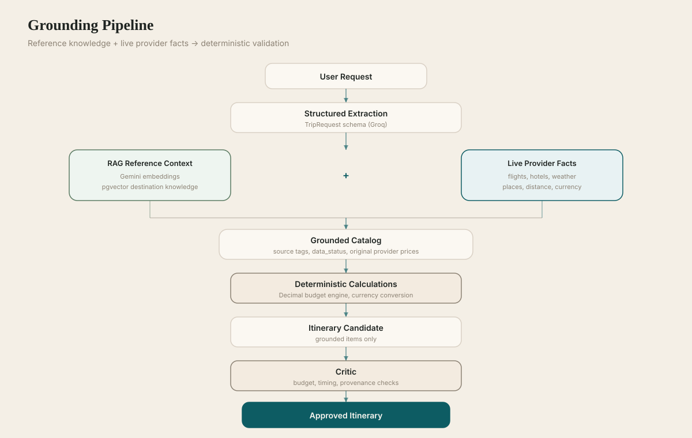

# AI Trip Planner

A grounded travel-planning agent that turns a natural-language trip request into a budget-aware, provider-backed itinerary you can revise without starting over.



_A completed trip in the planner: destination context, trip essentials, budget health, day-by-day itinerary, and map support._

## What it is

The AI Trip Planner is a full-stack agentic travel system—not a chat wrapper around an LLM. Users describe a trip in plain language; the backend extracts structured intent, retrieves destination reference knowledge, calls live travel providers in parallel, composes a deterministic day-by-day plan from grounded candidates, calculates budgets in application code, validates the result with a critic, and streams execution progress to the UI.

The product surface is a Next.js planner where travelers see **where they are going**, **what each day looks like**, **how much it costs**, and **what they can change next**—with provenance kept honest when data is live, sandbox, reference, or estimated.

## Why it is interesting

Most demo “AI trip planners” invent prices, hide provider failures, and replan everything on every edit. This project separates concerns deliberately:

| Concern                          | Owner                                    |
| -------------------------------- | ---------------------------------------- |
| Understanding user intent        | LLM (Groq)                               |
| Travel facts                     | External providers + Wikipedia reference |
| Candidate selection & scheduling | Deterministic composer                   |
| Totals & budget health           | Decimal budget engine                    |
| Feasibility & policy checks      | Deterministic critic                     |
| Selective edits                  | Modification subgraph + materializer     |

That split makes the system auditable: you can see which provider supplied each fact, which days changed, and why a budget line was included or excluded.

## Core experience

```text
Describe the trip
        ↓
Planner gathers live + reference data in parallel
        ↓
Grounded catalog → deterministic diverse composition
        ↓
Budget engine computes authoritative totals
        ↓
Critic validates timing, provenance, and constraints
        ↓
You inspect, refine in natural language, and re-validate
```

Canonical demo prompt:

```text
Plan a 5-day trip to Dubai for 2 people under ₹1,50,000 from Mumbai.
```

Follow-ups:

```text
Make day 2 more relaxed.
Make the trip more budget friendly.
```

## Product walkthrough

### 01 — Landing



The entry point: describe a trip in plain language.

### 02 — Empty planner



A focused planning workspace before a trip is created.

### 03 — Completed trip


A provider-backed trip with flight, stay, ground travel, itinerary, budget, and map context.

### 04 — Agent trace



Execution transparency: which tools ran, how long they took, and whether each source succeeded.

### 05 — Modification



Natural-language refinement changes the selected part of the itinerary while preserving the rest.

### 06 — Logistics details



Popover details for flight, stay, and estimated ground travel—including provenance and currency context.

## What happens when you plan a trip

1. **Extract requirements** — Groq structures destination, dates, travelers, budget, departure city, and preferences into a `TripRequest`.
2. **Validate** — Missing fields trigger clarification instead of guessing.
3. **Retrieve knowledge** — Gemini embeddings + pgvector supply destination reference context (RAG).
4. **Parallel tools** — Flights, hotels, weather, restaurants, attractions, and distance matrix run concurrently via MCP-style adapters.
5. **Aggregate & convert currency** — Provider-native amounts are preserved; Frankfurter converts to the trip currency when possible.
6. **Budget** — Python `Decimal` arithmetic produces totals, category lines, and health indicators.
7. **Compose itinerary** — `FakeItineraryComposer` runs `compose_diverse_itinerary()` over the grounded catalog (see [Composer note](#composer-architecture) below).
8. **Critic** — Deterministic checks on budget, timing, diversity, and provenance; bounded retries on failure.
9. **Finalize** — Completed run returned to the UI; SSE trace available throughout.

If a provider fails, that slice of the catalog may be **unavailable** while other tools continue—no fabricated substitute prices.

## What happens when you change a trip

```text
Natural-language request
        ↓
Modification intent extraction (LLM)
        ↓
Scope resolution (days, categories, budget intent)
        ↓
Grounded recomposition / catalog refresh where needed
        ↓
Deterministic materialization
        ↓
Budget recomputation
        ↓
Critic
        ↓
Only affected days/items change in the UI
```

Examples that work when providers and scope allow:

- `Make day 2 more relaxed.`
- `Find a cheaper dinner on day 3.`
- `Make the trip more budget friendly.`
- `Add more culture and less shopping.`

Not every phrase is guaranteed to succeed—provider availability and critic constraints bound what can change.

## Architecture



**System flow:** Browser (Clerk session) → Next.js planner → FastAPI agent API → LangGraph orchestration → PostgreSQL/pgvector + provider tool layer → SSE back to the UI.



**Agent lifecycle:** Request → validation → knowledge retrieval → parallel live tools → currency normalization → budget → itinerary composition → critic → finalize (or modification subgraph on follow-up messages).



**Provider architecture:** LangGraph nodes call application tool interfaces; `packages/mcp-tools` implements normalized contracts and provider adapters (timeouts, caching on error, source tagging).



**Grounding pipeline:** Reference knowledge + live provider results → grounded catalog → deterministic selection and scheduling → budget calculation → critic → approved itinerary.

## Provider matrix

| Capability           | Provider               | Mode             | Purpose                                           |
| -------------------- | ---------------------- | ---------------- | ------------------------------------------------- |
| LLM                  | Groq                   | Live             | Structured request / modification extraction      |
| Embeddings           | Gemini                 | Live             | 1536-dim RAG embeddings                           |
| Flights              | SerpApi Google Flights | Live             | Flight search (real offers, not booking)          |
| Hotels               | StayingAPI             | Sandbox          | Hotel search (demo inventory, not booking)        |
| Places               | Geoapify               | Live             | Restaurants, attractions, geocoding               |
| Landmark / reference | Wikipedia              | Reference API    | Landmark discovery and reference enrichment       |
| Weather              | Open-Meteo             | Live             | Forecast data (horizon-limited)                   |
| Distance             | OpenRouteService       | Live             | Route / distance **estimation** (not cab booking) |
| Currency             | Frankfurter            | Live             | FX conversion to trip currency                    |
| Auth                 | Clerk                  | Development/demo | Sign-in and API token verification                |

**Provenance labels in the UI:** Live · Sandbox · Reference · Estimated · Free · Unavailable.

Amadeus adapters remain in `packages/mcp-tools` for optional configuration (`FLIGHTS_PROVIDER=amadeus`, `HOTELS_PROVIDER=amadeus`), but the documented demo stack uses SerpApi + StayingAPI.

## Grounding and trust

```text
LLM → extracts intent and modification scope

Providers + Wikipedia → supply candidate facts

Deterministic selection → chooses grounded catalog items

Budget engine → calculates authoritative totals

Critic → validates the assembled plan
```

Reference landmarks (Wikipedia) do **not** receive invented live prices or hours. OpenRouteService supplies **estimated** ground travel between pinned locations—it does not book rides. StayingAPI returns **sandbox** hotel candidates, not live booking inventory.

## Budget and currency model

- All authoritative totals are computed in the API budget engine (`Decimal`), not by the LLM.
- Provider offers retain native currency until explicitly converted.
- Frankfurter reference rates convert to the trip currency when the pair is supported.
- Amounts that cannot be converted are **excluded** from the INR (or other) total with explicit UI messaging—not silently treated as zero.
- Over-budget trips are shown honestly; recovery suggestions appear in the UI when the plan exceeds the requested cap.
- Modifications re-run budget calculation when costs change.

The canonical Dubai scenario may land **over** ₹1,50,000 when live SerpApi flight quotes and StayingAPI sandbox stays are expensive—that is expected, not a bug.

## Failure handling

When one provider fails:

- That tool is marked unavailable in the trace and catalog.
- Other parallel tools continue.
- The aggregate run may still complete with partial data.
- The UI labels missing slices honestly—no invented flight or hotel fares.

Example: SerpApi unavailable → flights unavailable → itinerary and other categories may still complete.

## Composer architecture

Production and demo runtime:

```text
TripPlannerAgentService
  → FakeItineraryComposer
  → compose_diverse_itinerary()
```

The class name `FakeItineraryComposer` is historical. **It does not fabricate travel data** and is not a fake-data provider. It performs **deterministic diverse selection** over the grounded catalog built from real provider and reference results. LLM usage is concentrated in request understanding and modification intent—not in picking live prices or inventing activities.

## Technology stack

| Layer    | Technology                                         |
| -------- | -------------------------------------------------- |
| Frontend | Next.js 16, React, Clerk, Tailwind, Leaflet        |
| API      | FastAPI, Pydantic, SSE                             |
| Agent    | LangGraph, Groq                                    |
| RAG      | Gemini embeddings, pgvector, PostgreSQL            |
| Tools    | `packages/mcp-tools` (MCP-style provider adapters) |
| Monorepo | Turborepo, pnpm, uv                                |

## Local development

| Tool    | Version               |
| ------- | --------------------- |
| Node.js | ≥ 20                  |
| pnpm    | 9+ (repo uses 11.x)   |
| Python  | 3.13                  |
| uv      | latest                |
| Docker  | PostgreSQL + pgvector |

```bash
# 1. Infrastructure (user/db: trip_planner — not the default postgres role)
docker compose -f infra/docker-compose.yml up -d

# 2. Install JS dependencies
pnpm install

# 3. Backend Python env
cd apps/api && uv sync && cd ../..

# 4. Environment files (never commit real values)
cp apps/api/.env.example apps/api/.env
cp apps/web/.env.example apps/web/.env.local

# 5. Database migrations
cd apps/api && pnpm db:migrate && cd ../..

# 6. Run API + web (from repo root)
pnpm dev
```

- API: `http://127.0.0.1:8000` (`pnpm --filter @agentic-travel-engine/api dev`)
- Planner UI: `http://localhost:3002/planner` (`pnpm --filter @agentic-travel-engine/web dev`)

### Environment files

| File                  | Purpose                                    |
| --------------------- | ------------------------------------------ |
| `apps/api/.env`       | Backend secrets and provider configuration |
| `apps/web/.env.local` | Clerk publishable key, API URL             |

Backend keys (set in `.env`, never commit):

`GROQ_API_KEY`, `GEMINI_API_KEY`, `SERPAPI_API_KEY`, `STAYINGAPI_API_KEY`, `GEOAPIFY_API_KEY`, `OPENROUTESERVICE_API_KEY`, `CLERK_SECRET_KEY`

Frontend public:

`NEXT_PUBLIC_CLERK_PUBLISHABLE_KEY`, `NEXT_PUBLIC_API_URL`

See `apps/api/.env.example` and `apps/web/.env.example` for the full list.

## Demo

Step-by-step walkthrough: [`docs/demo.md`](docs/demo.md)

Screenshot capture guide: [`docs/screenshots/README.md`](docs/screenshots/README.md)

## Project structure

```text
apps/
  api/          FastAPI + LangGraph agent, budget, itinerary, modification
  web/          Next.js planner UI, Clerk auth, SSE client

packages/
  mcp-tools/    Provider adapters and normalized tool contracts
  shared-types/ Shared TypeScript types for API ↔ UI

infra/          Docker Compose (PostgreSQL + pgvector)
docs/           Demo guide, architecture SVGs, portfolio screenshots
scripts/        Repository utilities (e.g. SVG validation)
evals/          Future evaluation suites
```

## Limitations

- **StayingAPI sandbox** — hotel results are demo inventory, not booking-grade or live global coverage.
- **SerpApi quotas** — live flight search depends on API availability and rate limits.
- **Reference landmarks** — Wikipedia enriches discovery; no live admission prices or hours.
- **OpenRouteService** — route duration/distance estimates only; not cab or transit booking.
- **Open-Meteo** — forecast horizon and granularity are provider-limited.
- **Process-local runs** — restarting the API clears in-flight LangGraph checkpoints.
- **Deterministic composer naming** — production path uses `FakeItineraryComposer` (see above).
- **Geography & catalog quality** — candidate diversity depends on what providers return for each city.

## Engineering notes

**Technical differentiators**

1. Parallel tool orchestration with per-tool failure isolation.
2. Stable application tool contracts backed by `packages/mcp-tools` adapters.
3. Grounded candidate fusion (live + reference) before composition.
4. Deterministic diverse itinerary composition—not LLM day planning.
5. Decimal budget engine with explicit currency conversion and exclusion rules.
6. Deterministic critic with bounded retries.
7. Selective modification subgraph and materializer.
8. SSE execution trace for transparency.
9. Honest provenance and unavailable states in the UI.

**Testing**

```bash
# Monorepo
pnpm type-check && pnpm lint && pnpm test && pnpm build

# API
cd apps/api
uv run ruff check app tests alembic
uv run pytest

# MCP tools
cd packages/mcp-tools
uv run pytest

# Web
cd apps/web
pnpm type-check && pnpm lint && pnpm test && pnpm test:e2e && pnpm build
```

Provider smoke (live keys required):

```bash
cd apps/api
uv run python scripts/provider_smoke.py
uv run python scripts/e2e_trip_run.py
```

Architecture SVG validation:

```bash
python scripts/validate_architecture_svgs.py
```
